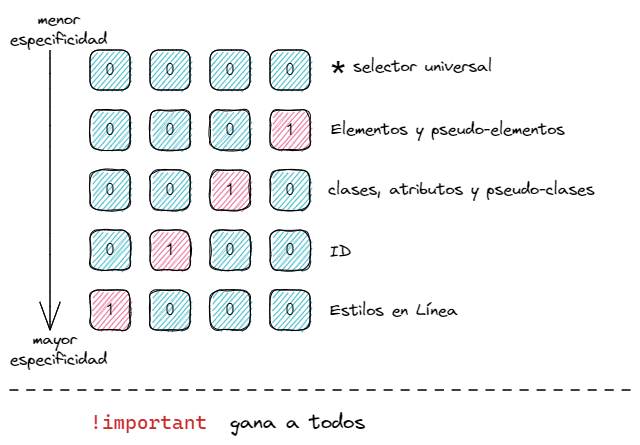

# Flexbox

[Maquetación con flexbox](https://www.adictosaltrabajo.com/2018/02/14/maquetacion-con-flexbox/)

contenedor {

 ` display: flex;`
 
  `flex-direction:` `row` | `column`; //Eje primario: eje_x(row) | eje_y(column)
  
  //Alineación en el eje primario
  
  `justify-content`: `flex-start` | `flex-end` | `center` | `space-between` | `space-around` | `space-evenly`; 
  
  //Alineación en el eje secundario
  
  `align-items`: `flex-start` | `flex-end` | `center` | `baseline` | `stretch`; 
  
  //Responsividad avanzada
  
  `flex-wrap`: `wrap`;
  
 `flex-wrap` Permite disponer a los hijos en varias lineas si surgiese la casuística de que no consiguiesen caber en una única línea.
  
  width: 100%;
  
  height: 100vh;
  
  padding: 0.5rem;
  
  background-color: blanchedalmond;
  
}

`flex-direction`: estable el eje principal 

`justify-content`: Los elementos hijos son alineados en el eje principal.

hijos{

 `flex` : `none` | [ <'`flex-grow`'> <'`flex-shrink`'>? || <'`flex-basis`'> ]

}

El valor de flex por defecto es 0 1 auto. Podemos alternar la propiedad flex de cada elemento para modificar su peso:

    flex: 2;..

`flex-grow`: Define la habilidad de un hijo de ocupar espacio sobrante. Recibe un entero. Por defecto es 0.

`flex-shrink`: Define la habilidad de un hijo de encogerse. Recibe un entero. Por defecto es 0.

`flex-basis`: Esta propiedad especifica el tamaño base que ocupa un elemento hasta que éste se puede encoger o ensanchar.

Su valor puede ser una unidad o auto (cuyo valor es el por defecto).

#Ancla en html
...

# Clases

`class="class1 class2"` Las clases se espacian para separarlas

# Especificidad

Cuanto más elementos tenga el selector, más específico es, y mayor prioridad tiene, sin verse afectado por la lectura en cascada.

# Selectores

`*` Selector universal

e `,` e Selecciona ambos

## Selector de clase

`.classname`  el.classname

## Selector de id

`#idname`

## Selectores de atributo

`[attr]`        Selecciona los elementos que tienen el atributo attr.
  
`[attr=value]`  Selecciona los elementos cuyo atributo attr tenga exactamente el valor value.

`[attr~=value]` Selecciona los elementos cuyo atributo attr tenga por valor una lista de palabras separadas por espacios,    una de las cuales sea value.

`[attr|=value]` Selecciona los elementos cuyo atributo attr tenga exactamente el valor value o empiece por value seguido de un guión -

`[attr^=value]`   Selecciona los elementos cuyo atributo attr tenga un valor prefijado por value.

`[attr$=value]`   Selecciona los elementos cuyo atributo attr cuyo valor tiene el sufijo (seguido) de value.

`[attr*=value]`   Selecciona los elementos cuyo atributo attr tenga un valor que contenga value.

## Combinadores

**Combinadores descendientes**

`A B`     El combinador (espacio) selecciona los elementos que son descendientes del primer elemento.

**Combinador de hijo**

`A > B`   El combinador > selecciona los elementos que son hijos directos del primer elemento.

**Combinador de hermanos adyacentes**

`A + B`   El combinador + selecciona hermanos adyacentes. Esto quiere decir que el segundo elemento sigue directamente al primero y ambos comparten el mismo elemento padre.

**Combinador general de hermanos**

`A ~ B`   El combinador ~ selecciona hermanos. Esto quiere decir que el segundo elemento sigue al primero (no necesariamente de forma inmediata) y ambos comparten el mismo elemento padre.

## Pseudoclases

Palabra clave que se añade a los selectores y que especifica un estado especial del elemento seleccionado.

`selector:pseudoclase { propiedad: valor; }`

## Pseudoelementos

Permiten añadir estilos a una parte concreta del documento.

`selector::pseudo-elemento { propiedad: valor; }`

## Diferencia entre > y :first-child

# Propiedades

`display` : `block` | `inline`| `inline-block` | `flex` | `grid`

## Keywords

propiedad: 

-`none` -> borrar un propiedad

-`inherit` -> valor de la propiedad heredada del elemento padre

-`initial` -> restablece el valor

-`unset` -> restablece el valor al valor heredado o a su valor inicial

## Medidas

### Absolutas:

`px` No cambia sin importar el tamaño del proyecto.

### Relativas

`em` hace referencia al tamaño actual de la fuente que ha sido establecido en el navegador.

`rem` representa el tamaño (font-size) del elemento raiz ...

### Flexibles

`vw`: se calcula con respecto al ancho del viewport.
  100vw = 100% de la ventana

`vh`: se calcula con respecto a la altura del viewport.

`vmin/vmax`

`%`: respecto al padre

## Box model

\* {

  `box-sizing: border-box;`
  
}

Redefine de qué manera ha de calcular la altura y la anchura de los elementos de nuestra página. Es prácticamente

obligatorio definir esta propiedad si queremos que nuestra maquetación sea predecible.

`border-box` provoca que los paddings y bordes se apliquen en el interior de la caja.
